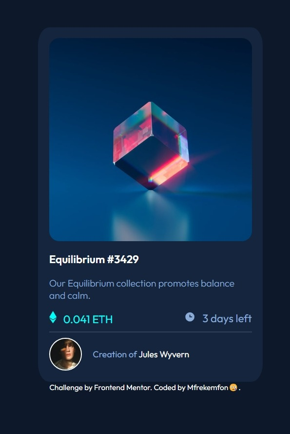
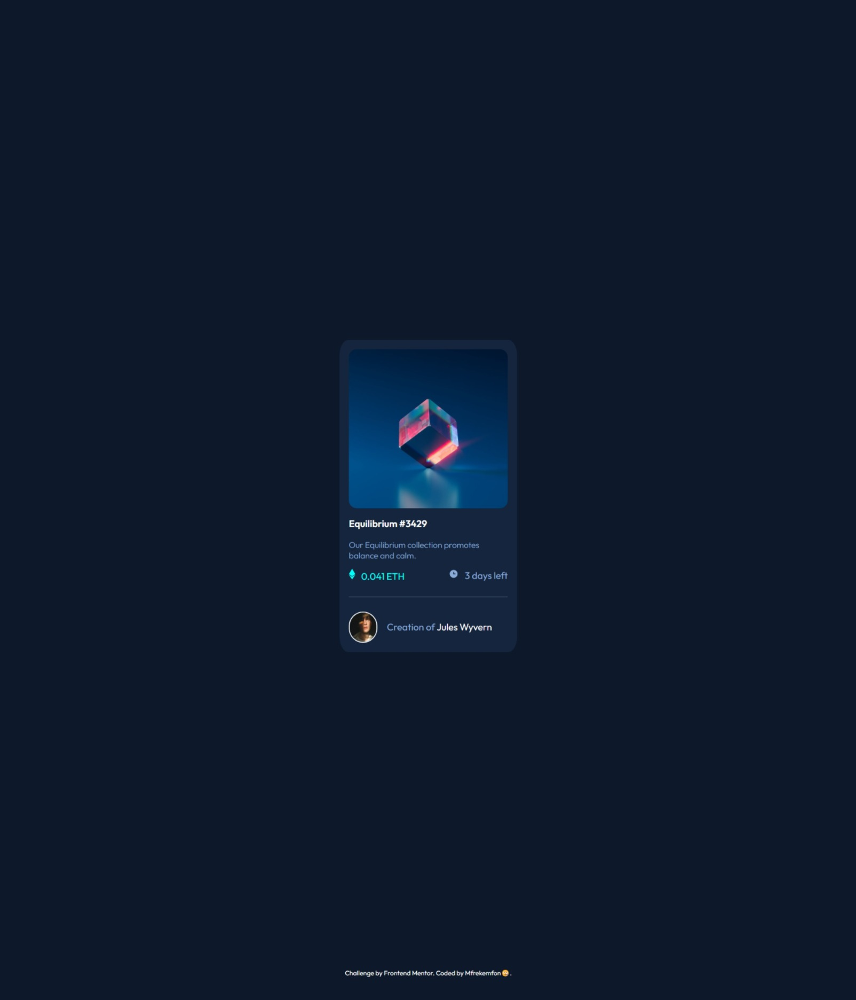

# Frontend Mentor - NFT preview card component solution

This is a solution to the [NFT preview card component challenge on Frontend Mentor](https://www.frontendmentor.io/challenges/nft-preview-card-component-SbdUL_w0U). Frontend Mentor challenges help you improve your coding skills by building realistic projects. 

## Table of contents

- [Overview](#overview)
  - [The challenge](#the-challenge)
  - [Screenshots](#screenshots)
  - [Links](#links)
- [My process](#my-process)
  - [Built with](#built-with)
  - [What I learned](#what-i-learned)
  - [Continued development](#continued-development)
  - [Useful resources](#useful-resources)
- [Author](#author)
- [Acknowledgments](#acknowledgments)


## Overview

### The challenge
Users should be able to:
- View the optimal layout depending on their device's screen size
- See hover states for interactive elements

### Screenshots




### Links
- Solution URL: [Here's my solution on FrontEnd Mentor](https://www.frontendmentor.io/solutions/nft-preview-card-component-using-html-and-css-zyeaIVEUCB)
- Live Site URL: [Here's the main webpage](https://mfrekee.github.io/nft-preview-card-component-main/)


## My process

### Built with
- Semantic HTML5 markup
- CSS custom properties
- Flexbox
- Mobile-first workflow

### What I learned
This section highlights some of the new properties that I have recently learned.

```css
.css-i-learnt {

    .container:hover .img-1 {
    opacity: 0.3;
  }

    .container:hover .eye {
    opacity: 1;
    }

    .img-1{
   transition: .5s ease;
   opacity: 1;
   backface-visibility: hidden;
}

    .eye{
    transition: .5s ease;
    opacity: 0;
    position: absolute;
    top: 50%;
    left: 50%;
    transform: translate(-50%,-50%);
}
}
```

### Continued development
In future projects, I intend to focus on learning more animation properties.

### Useful resources
- [Image Hover Overlay](https://www.w3schools.com/howto/howto_css_image_overlay.asp) - This helped me in creating the overlay effect for the first image.
- [Rounded Borders](https://www.w3schools.com/csS/css_border_rounded.asp) - This helped me remember how I could apply the round border in the second image.


## Author
- Frontend Mentor - [@Mfrekee](https://www.frontendmentor.io/profile/Mfrekee)
- Twitter - [@acmfrekemfon](https://twitter.com/acmfrekemfon)

